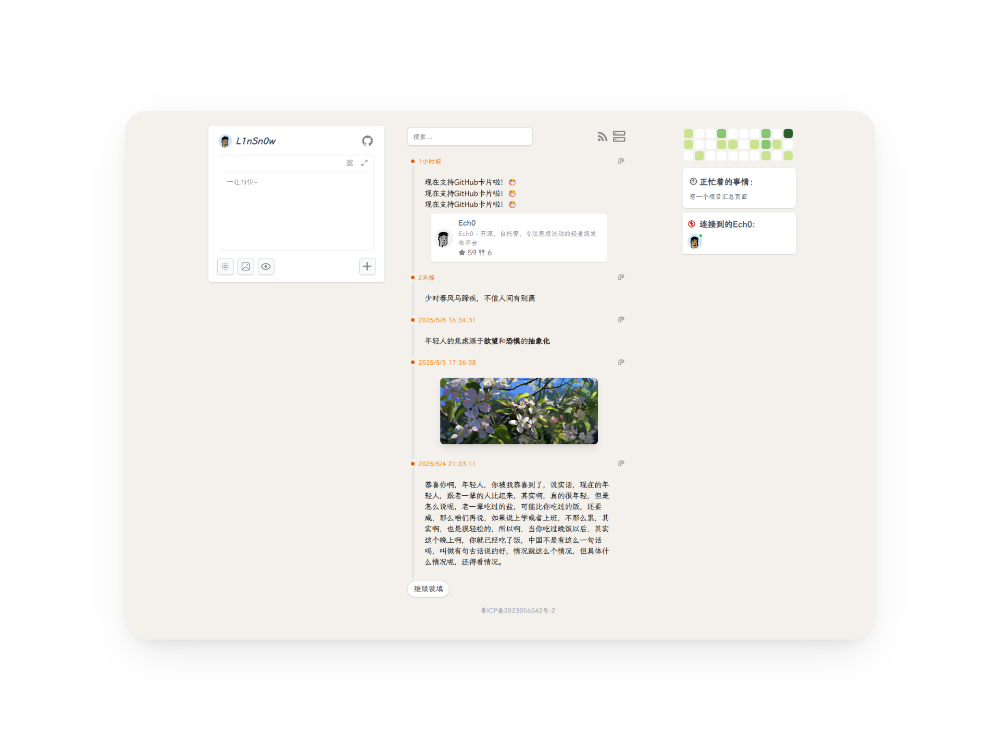

# Ech0 - 开源、自托管、专注思想流动的轻量级发布平台

<p align="center">
  
</p>

Ech0 是一款专为轻量级分享而设计的开源自托管平台，支持快速发布与分享你的想法、文字与链接。简单直观的操作界面，轻松管理你的内容，让分享变得更加自由，确保数据完全掌控，随时随地与世界连接。



[预览地址](https://echo.soopy.cn/)

---

## 核心优势

☁️ **原子级轻量**：内存占用仅**5.09MB**，整个镜像大小不到**45MB**，单SQLite文件存储架构  
🚀 **极速部署**：无需配置，从安装到使用只需1条命令  
✍️ **零干扰写作**：纯净的在线Markdown编辑器，**所见即所得**  
📦 **数据主权**：所有内容存储于本地SQLite文件，支持RSS订阅  
🎉 **永久免费**：MIT协议开源，无追踪/无订阅/无服务依赖  
🌍 **跨端适配**：完美兼容桌面/移动浏览器  

---

## 3秒极速部署

### docker部署

```shell
docker run -d \
  --name ech0 \
  -p 1314:1314 \
  -v /opt/ech0/data:/app/data \
  sn0wl1n/ech0:v3.1.0
```

> 💡 部署完成后访问 ip:1314 即可使用
> 
> 📍 首次使用注册的账号会被设置为管理员（目前仅管理员支持发布内容）

### docker-componse部署

创建一个新目录并将 `docker-compose.yml` 文件放入其中

在该目录下执行以下命令启动服务：

```shell
docker-compose up -d
```

## 如何更新

```shell
# 停止当前的容器
docker stop ech0

# 移除容器
docker rm ech0

# 拉取最新的镜像
docker pull sn0wl1n/ech0:v3.1.0

# 启动新版本的容器
docker run -d \
  --name ech0 \
  -p 1314:1314 \
  -v /opt/ech0/data:/app/data \
  sn0wl1n/ech0:v3.1.0
```

---

<p align="center">「少即是多」—— 路德维希·密斯·凡德罗</p>
