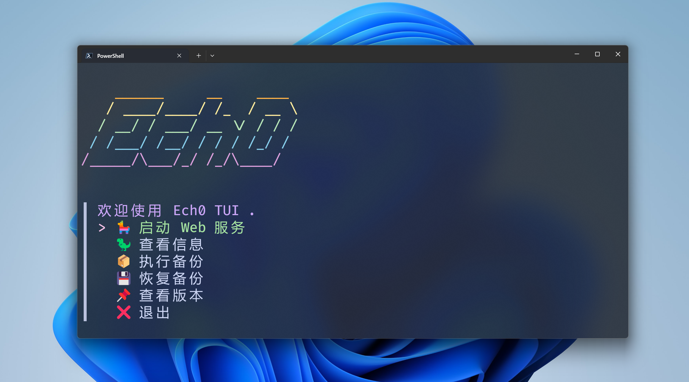
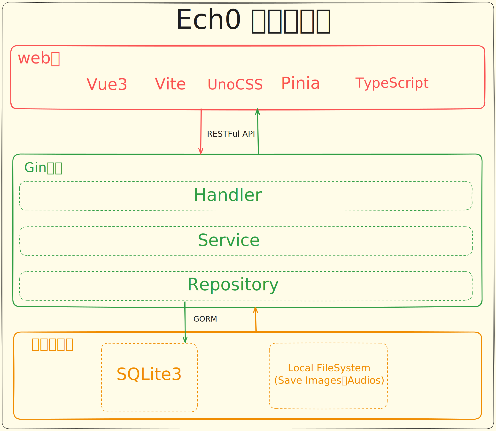

<div align="right">
  <a title="en" href="./README.zh.md"></a>
  
</div>

<div align="center">
  

  [Preview](https://memo.vaaat.com/) | [Official Site](https://echo.soopy.cn/) | [Documentation](https://echodoc.soopy.cn/) | [Ech0 Hub](https://echohub.soopy.cn/)

  # Ech0
</div>

<div align="center">

[](https://github.com/lin-snow/Ech0/releases)  [](https://deepwiki.com/lin-snow/Ech0)

</div>

> A next-generation open-source, self-hosted, lightweight federated publishing platform focused on personal idea sharing.

Ech0 is a new-generation open-source self-hosted platform designed for individual users. It is ultra-lightweight and low-cost, supporting the ActivityPub protocol to let you easily publish and share ideas, writings, and links. With a clean, intuitive interface and powerful command-line tools, content management becomes simple and flexible. Your data is fully owned and controlled by you, always connected to the world, building your own network of thoughts.


---

<details>
   <summary><strong>Table of Contents</strong></summary>

- [Ech0](#ech0)
  - [Highlights](#highlights)
  - [Quick Deployment](#quick-deployment)
    - [🐳 Docker (Recommended)](#-docker-recommended)
    - [🐋 Docker Compose](#-docker-compose)
  - [Upgrading](#upgrading)
    - [🔄 Docker](#-docker)
    - [💎 Docker Compose](#-docker-compose-1)
  - [Access Modes](#access-modes)
    - [🖥️ TUI Mode](#️-tui-mode)
    - [🔐 SSH Mode](#-ssh-mode)
  - [FAQ](#faq)
  - [Feedback \& Community](#feedback--community)
  - [Architecture](#architecture)
  - [Development Guide](#development-guide)
    - [Backend Requirements](#backend-requirements)
    - [Frontend Requirements](#frontend-requirements)
    - [Start Backend \& Frontend](#start-backend--frontend)
  - [Acknowledgements](#acknowledgements)
  - [Star History](#star-history)
  - [Support](#support)
</details>

---

## Highlights

- ☁️ **Ultra Lightweight** — Memory usage under **15MB**, image size under **45MB**, single SQLite file storage.
- 🚀 **Blazing Fast Deployment** — No configuration needed, install and use with just one command.
- 🧰 **Command-line Power** — Built-in high-availability CLI tools that support one-click backup, restore, and export.
- 📟 **TUI Friendly** — Terminal-friendly interactive interface to manage Ech0 from the TUI.
- ✍️ **Distraction-Free Writing** — Clean online Markdown editor with rich plugin support and live preview.
- 📦 **Data Ownership** — All content stored locally in SQLite, with RSS feed support.
- 🔐 **Secure Backup** — One-click export/backup/import via Web, TUI, or CLI.
- ♻️ **Seamless Restore** — Restore any backup via TUI or CLI to ensure data safety.
- 🎉 **Completely Free** — Open-source under AGPL-3.0 with no tracking, subscription, or dependency.
- 🌍 **Cross-Device Compatible** — Fully responsive on desktop, tablet, and mobile.
- 👾 **PWA Support** — Can be installed as a Web App.
- ☁️ **S3 Storage Support** — Native integration with S3-compatible object storage for local or cloud backups.
- 🌐 **ActivityPub Federation** — Native ActivityPub support for interoperability with Mastodon, Misskey, Pleroma, etc.
- 📝 **Built-in Todo Management** — Record and track daily tasks efficiently.
- 🔗 **Ech0 Connect** — Cross-instance content aggregation, subscription, and synchronization.
- 🎵 **Music Integration** — Lightweight audio player for local streaming and immersive background music.
- 🎥 **Video Sharing** — Native support for Bilibili/YouTube smart parsing.
- 🃏 **Rich Card Support** — Share website links, GitHub projects, and other media-rich content.
- ⚙️ **Advanced Customization** — Custom styles and scripts for enhanced content presentation.
- 💬 **Comment System** — Integrate Twikoo for lightweight interaction and feedback.
- 💻 **Cross-Platform** — Native support for Windows, Linux, and ARM devices like Raspberry Pi.
- 🔗 **Official Ech0 Hub Integration** — Submit content to the Ech0 Hub ecosystem easily.
- 🌐 **Self-Hosted Ech0 Hub** — Use your Connect list as a content source.
- 📦 **Self-contained Binary** — Full frontend resources included, single binary file ready to run.
- 🔗 **Rich API Support** — Open API available for integration with other systems.
- 🃏 **Content Display** — Supports X (Twitter)-style card display with social interactions.
- 👤 **Multi-user and Permissions** — Flexible account and permission management for secure access.

---

## Quick Deployment

### 🐳 Docker (Recommended)

```shell
docker run -d \
  --name ech0 \
  -p 6277:6277 \
  -p 6278:6278 \
  -v /opt/ech0/data:/app/data \
  -v /opt/ech0/backup:/app/backup \
  -e JWT_SECRET="Hello Echos" \
  sn0wl1n/ech0:latest
```

> 💡 After deployment, access `ip:6277` to use  
> 🚷 It is recommended to change `JWT_SECRET="Hello Echos"` to a secure secret  
> 📍 The first registered user will be set as administrator  
> 🎈 Data stored under `/opt/ech0/data`

### 🐋 Docker Compose

1. Create a new directory and place `docker-compose.yml` inside.  
2. Run:

```shell
docker-compose up -d
```

---

## Upgrading

### 🔄 Docker

```shell
docker stop ech0
docker rm ech0
docker pull sn0wl1n/ech0:latest
docker run -d \
  --name ech0 \
  -p 6277:6277 \
  -p 6278:6278 \
  -v /opt/ech0/data:/app/data \
  -v /opt/ech0/backup:/app/backup \
  -e JWT_SECRET="Hello Echos" \
  sn0wl1n/ech0:latest
```

### 💎 Docker Compose

```shell
cd /path/to/compose
docker-compose pull && \
docker-compose up -d --force-recreate
docker image prune -f
```

---

## Access Modes

### 🖥️ TUI Mode



Run the binary directly (for example, on Windows double-click `Ech0.exe`).

### 🔐 SSH Mode

Connect to the instance via port 6278:

```shell
ssh -p 6278 ssh.vaaat.com
```

---

## FAQ

1. **What is Ech0?**  
   A lightweight, open-source self-hosted platform for quickly sharing thoughts, writings, and links. All content is locally stored.  

2. **What Ech0 is NOT?**  
   Not a professional note-taking app like Obsidian or Notion; its core function is similar to social feed/microblog.  

3. **Is Ech0 free?**  
   Yes, fully free and open-source under AGPL-3.0, no ads, tracking, subscription, or service dependency.  

4. **How do I back up and restore data?**  
  Since all content is stored in a local SQLite file, you only need to back up the files in the `/opt/ech0/data` directory (or the mapped path you chose during deployment). To restore, simply replace the data files with your backup. You can also use the online data management features in the settings under "Data Management" to quickly create, export, or restore snapshots. If the latest content does not appear after restoring, try manually restarting the Docker container.

5. **Does Ech0 support RSS?**  
   Yes, content updates can be subscribed via RSS.  

6. **Why can't I publish content?**  
   Only administrators can publish. First registered user is admin.  

7. **Why no detailed permission system?**  
   Ech0 emphasizes simplicity: admin vs non-admin only, for smooth experience.  

8. **Why Connect avatars may not show?**  
   Set your instance URL in `System Settings - Service URL` (with `http://` or `https://`).  

9. **What is MetingAPI?**  
   Used to parse music streaming URLs for music cards. If empty, default API provided by Ech0 is used.  

10. **Why not all Connect items show?**  
    Instances that are offline or unreachable are ignored; only valid instances are displayed.  

11. **What content is not recommended?**  
    Avoid publishing dense content mixing text + images + extension cards. Long posts or extension cards alone are okay.  

12. **How to enable comments?**  
    Set up Twikoo backend URL in settings. Only Twikoo is supported.  

13. **How to configure S3?**  
    Fill in endpoint (without http/https) and bucket with public access.

14. **How to join the Fediverse?**  
  You need to bind Ech0 to a domain name and fill in the domain in the server address field in the settings page. Once set, Ech0 will automatically join the Fediverse. Example: `https://memo.vaaat.com`

---

## Feedback & Community

- Report bugs via [Issues](https://github.com/lin-snow/Ech0/issues).
- Propose features or share ideas in [Discussions](https://github.com/lin-snow/Ech0/discussions).

---

## Architecture

  
> by ExcaliDraw

---

## Development Guide

### Backend Requirements
- Go 1.25.1+  
- C Compiler for CGO (`go-sqlite3`):
  - Windows: [MinGW-w64](https://winlibs.com/)  
  - macOS: `brew install gcc`  
  - Linux: `sudo apt install build-essential`  
- Google Wire: `go install github.com/google/wire/cmd/wire@latest`  
- Golangci-Lint: `golangci-lint run` / `golangci-lint fmt`  
- Swagger: `swag init -g internal/server/server.go -o internal/swagger`  

### Frontend Requirements
- NodeJS v24.5.0+, PNPM v10.17.1+  
- Use [fnm](https://github.com/Schniz/fnm) if multiple Node versions needed

### Start Backend & Frontend
```shell
# Backend
go run cmd/ech0/main.go

# Frontend
cd web
pnpm install
pnpm dev
```

Preview: Backend `http://localhost:6277`, Frontend `http://localhost:5173`

> When importing layered packages, prefer consistent aliases such as `xxxModel`, `xxxService`, `xxxRepository`, and so on.

---

## Acknowledgements

- [Gin](https://github.com/gin-gonic/gin)  
- [Md-Editor-V3](https://github.com/imzbf/md-editor-v3)  
- [Figma](https://www.figma.com/)  
- [VSCode](https://code.visualstudio.com/) & [GoLand](https://www.jetbrains.com/go/)  
- Open-source community contributors

---

## Star History

<a href="https://www.star-history.com/#lin-snow/Ech0&Timeline">
 <picture>
   <source media="(prefers-color-scheme: dark)" srcset="https://api.star-history.com/svg?repos=lin-snow/Ech0&type=Timeline&theme=dark" />
   <source media="(prefers-color-scheme: light)" srcset="https://api.star-history.com/svg?repos=lin-snow/Ech0&type=Timeline" />
   
 </picture>
</a>

---

## Support

🌟 If you like **Ech0**, please give it a Star! 🚀  
Ech0 is completely free and open-source. Support helps the project continue improving.  

| Platform | QR Code |
| :------: | :------ |
| [**Afdian**](https://afdian.com/a/l1nsn0w) |  |

---

```cpp

███████╗     ██████╗    ██╗  ██╗     ██████╗ 
██╔════╝    ██╔════╝    ██║  ██║    ██╔═████╗
█████╗      ██║         ███████║    ██║██╔██║
██╔══╝      ██║         ██╔══██║    ████╔╝██║
███████╗    ╚██████╗    ██║  ██║    ╚██████╔╝
╚══════╝     ╚═════╝    ╚═╝  ╚═╝     ╚═════╝ 

``` 
